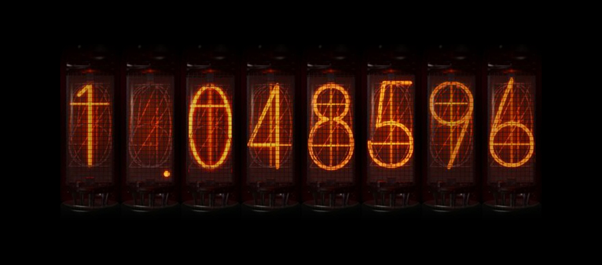
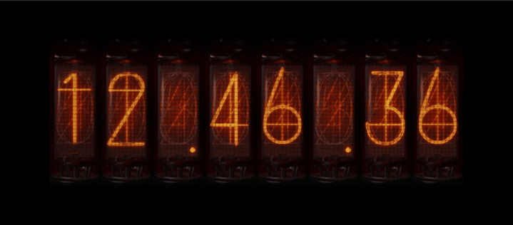
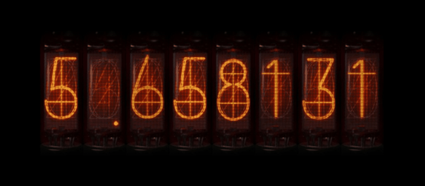

# Divergence Meter

**This project was inspired by [Nixie](https://github.com/Asterecho/Nixie)**.



> El Psy Kongroo.    —— Steins;Gate


## usage

There are two implementations, one based on cv2 and the other based on pyqt

### cv2
```shell
pip install -r requirements_cv2.txt
```
```python
from divergence_meter_cv2 import DivergenceMeter
d = DivergenceMeter()
d.clock() # show clock
d.meter() # show meter
d.show(images=['1.048596', '3.1415926', '10086'], wait_time=[1000, 2000, 3000]) # custom image sequence
```

### pyqt
```shell
pip install -r requirements_pyqt.txt
```
```python
# pyqt
from divergence_meter_pyqt import qt
qt()
```


## clock



## meter



